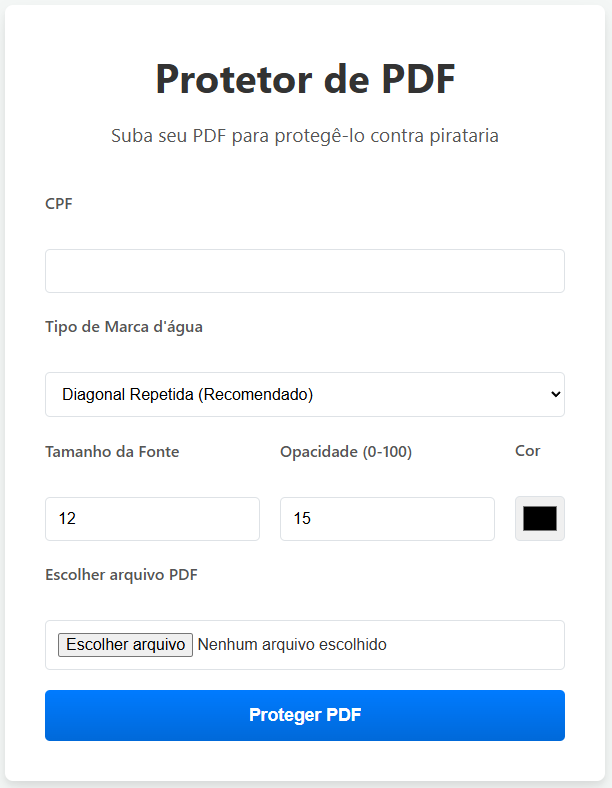

# Protetor de PDF 🛡️

Uma aplicação web completa construída com Flask para adicionar marcas d'água personalizadas (texto ou imagem) em arquivos PDF, protegendo seus documentos contra distribuição não autorizada.

## Demonstração Visual



## ✨ Funcionalidades Principais

-   **Dois Tipos de Marca d'água:** Escolha entre aplicar um texto personalizado ou uma imagem (como um logo) como marca d'água.
-   **Estilos de Aplicação:** Aplique a marca d'água em um padrão diagonal repetido, no centro da página ou em um canto específico.
-   **Controle Total de Estilo:** Personalize a opacidade, cor e tamanho da fonte (para texto) para criar a proteção ideal.
-   **Upload Seguro de Arquivos:** Interface para upload de PDFs e imagens com validação de tipo de arquivo.
-   **Interface Interativa:** O formulário se adapta dinamicamente à sua escolha de marca d'água (texto ou imagem).
-   **Download Direto:** Baixe o novo arquivo PDF protegido diretamente da aplicação após o processamento.

## 🛠️ Tecnologias Utilizadas

Este projeto foi construído com uma stack moderna e robusta, pronta para produção.

#### Backend


#### Frontend


#### DevOps & Infraestrutura


## ⚙️ Como Funciona (Fluxo Técnico)

1.  **Interface do Usuário:** O usuário acessa a página principal, que exibe um formulário dinâmico construído com **Flask-WTF** para validação de dados e proteção CSRF. O JavaScript adapta a interface com base na escolha do tipo de marca d'água.
2.  **Envio de Dados:** Ao submeter, o arquivo PDF, as configurações e a imagem da marca d'água (se aplicável) são enviados via `POST` para o servidor **Flask**.
3.  **Processamento em Memória:** A função `modify_pdf` é chamada. Em vez de criar arquivos temporários, ela usa **ReportLab** para gerar um novo PDF de uma única página (a marca d'água) diretamente na memória, utilizando `io.BytesIO`.
    -   Se for **texto**, ele desenha o texto com a formatação especificada.
    -   Se for **imagem**, ele a carrega e desenha na "tela" do PDF.
4.  **Mesclagem de PDFs:** A biblioteca **PyPDF2** é usada para ler o PDF original e o PDF da marca d'água em memória.
5.  **Aplicação da Marca d'água:** O código itera sobre cada página do PDF original e mescla (merge) a página da marca d'água sobre ela.
6.  **Salvamento e Resposta:** O novo PDF, agora protegido, é salvo na pasta `uploads` com um novo nome. A rota Flask renderiza a página novamente, exibindo uma mensagem de sucesso e um link para download do arquivo final.

## 🚀 Como Executar o Projeto

Existem duas maneiras de rodar esta aplicação: localmente para desenvolvimento ou de forma containerizada com Docker para um ambiente de produção.

### 1. Execução com Docker (Recomendado)

Esta é a maneira mais simples e confiável de executar o projeto, pois encapsula todas as dependências.

**Pré-requisitos:**
- Docker
- Docker Compose

**Passos:**
1.  **Clone o repositório:**
    ```bash
    git clone https://github.com/alissonpef/Flask-PDF-Protector.git
    cd Flask-PDF-Protector
    ```

2.  **Configure as variáveis de ambiente:**
    - Crie um arquivo chamado `.env` na raiz do projeto.
    - Adicione a seguinte linha a ele (use uma chave longa e aleatória):
      ```
      SECRET_KEY='sua-chave-secreta-muito-forte-e-aleatoria'
      ```

3.  **Construa a imagem e inicie o contêiner:**
    ```bash
    docker-compose up --build
    ```

4.  Acesse **http://127.0.0.1:5000** no seu navegador.

### 2. Execução Local

**Pré-requisitos:**
- Python 3.8+
- pip

**Passos:**

1.  **Clone o repositório** (se ainda não o fez).
    ```bash
    git clone https://github.com/alissonpef/Flask-PDF-Protector.git
    cd Flask-PDF-Protector
    ```

2.  **Crie e ative um ambiente virtual:**
    ```bash
    python -m venv env
    ```
    *   **No Windows (usando Git Bash):**
        ```bash
        source env/Scripts/activate
        ```
    *   **No macOS ou Linux:**
        ```bash
        source env/bin/activate
        ```

3.  **Instale as dependências:**
    ```bash
    pip install -r requirements.txt
    ```

4.  **Configure as variáveis de ambiente** (crie o arquivo `.env` como descrito na seção Docker).

5.  **Execute a aplicação:**
    ```bash
    python src/app.py
    ```

6.  Acesse **http://127.0.0.1:5000** no seu navegador.

## 📁 Estrutura do Projeto

A estrutura do projeto foi organizada para separar as responsabilidades e facilitar a manutenção, seguindo padrões de aplicações Flask.

```
/
├── .env                  # Variáveis de ambiente (SECRET_KEY)
├── .gitignore            # Arquivos ignorados pelo Git
├── .dockerignore         # Arquivos ignorados pelo Docker
├── .editorconfig         # Padrões de formatação do código
├── Dockerfile            # Receita para construir a imagem Docker
├── docker-compose.yml    # Orquestração do contêiner com Docker Compose
├── README.md             # Esta documentação
├── requirements.txt      # Dependências do Python
└── src/                  # Pasta principal com o código-fonte da aplicação
    ├── app.py            # Lógica principal do Flask (rotas)
    ├── forms.py          # Definição dos formulários com Flask-WTF
    ├── pdf_modifier.py   # Função que manipula o PDF
    ├── static/           # Arquivos CSS e JavaScript
    │   └── styles.css
    ├── templates/        # Arquivos HTML (Jinja2)
    │   └── index.html
    └── uploads/          # Pasta para armazenar os PDFs (criada automaticamente)
```

## 🔮 Melhorias Futuras

Este projeto tem uma base sólida e pode ser expandido com novas funcionalidades:

-   [ ] **Processamento Assíncrono:** Usar uma fila de tarefas (Celery, RQ) para processar PDFs grandes em segundo plano sem travar a interface.
-   [ ] **Contas de Usuário:** Sistema de login para que os usuários possam ver um histórico de seus arquivos processados.
-   [ ] **Processamento em Lote:** Permitir o upload de múltiplos PDFs para aplicar a mesma marca d'água em todos.
-   [ ] **Pré-visualização da Marca d'água:** Mostrar uma prévia de como a marca d'água ficará no PDF antes do processamento final.

---

## 📫 Vamos Conectar!

Adoraria trocar ideias sobre desenvolvimento backend, Python, Flask ou outras tecnologias. Fique à vontade para entrar em contato ou me adicionar nas redes.

[](https://www.linkedin.com/in/alisson-pereira-ferreira-450223b/)
[](mailto:alissonpef@gmail.com)

---
Feito com ❤️ por **Alisson Pereira**.
